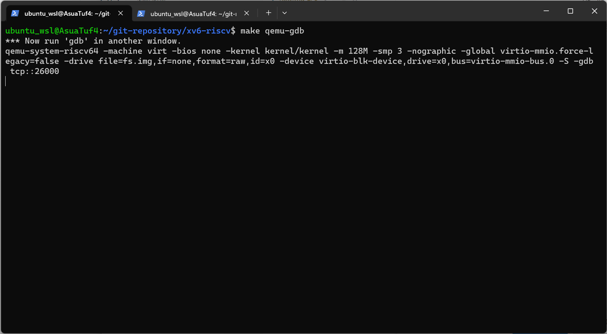
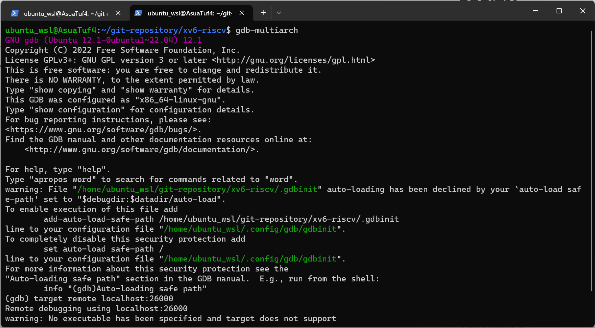
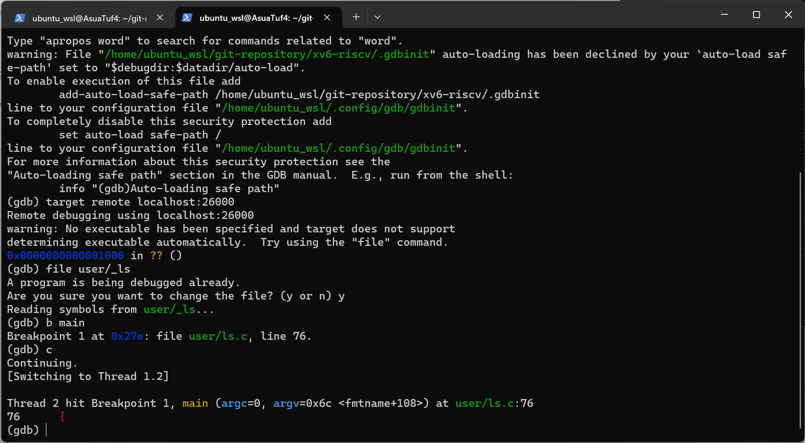
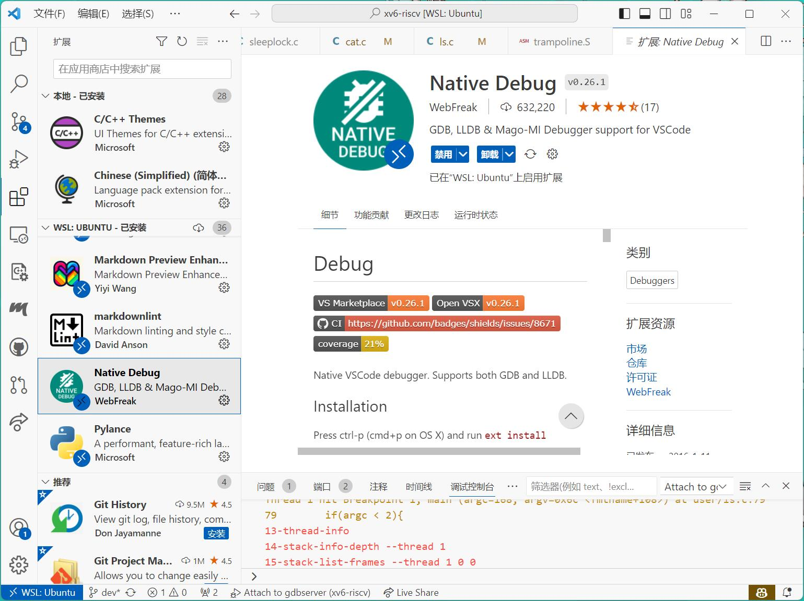
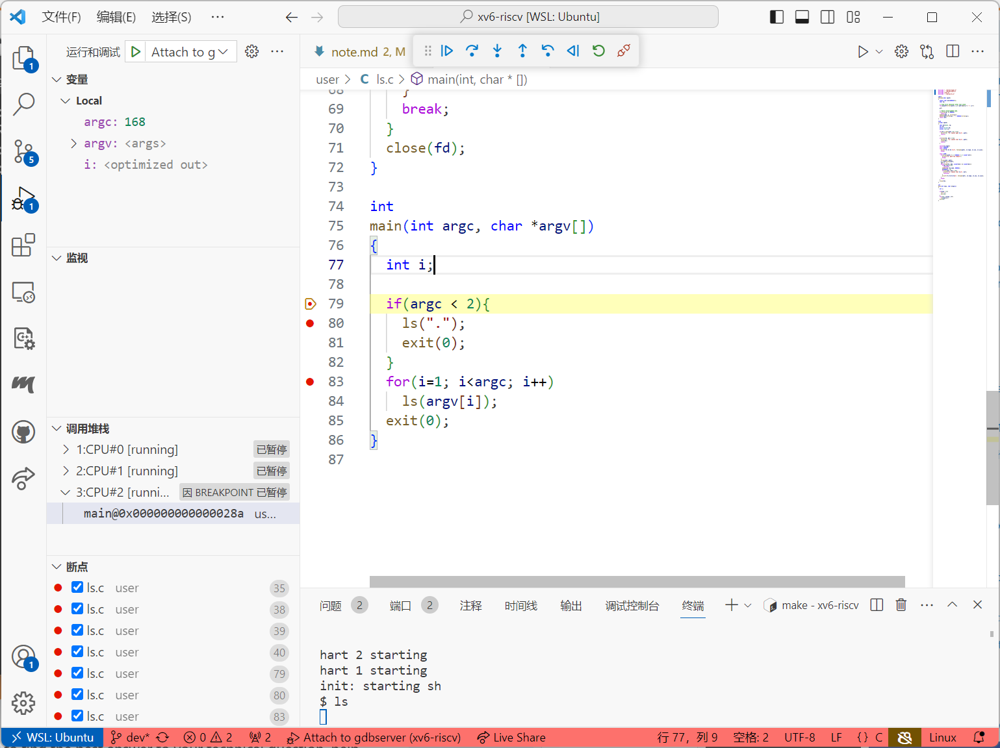
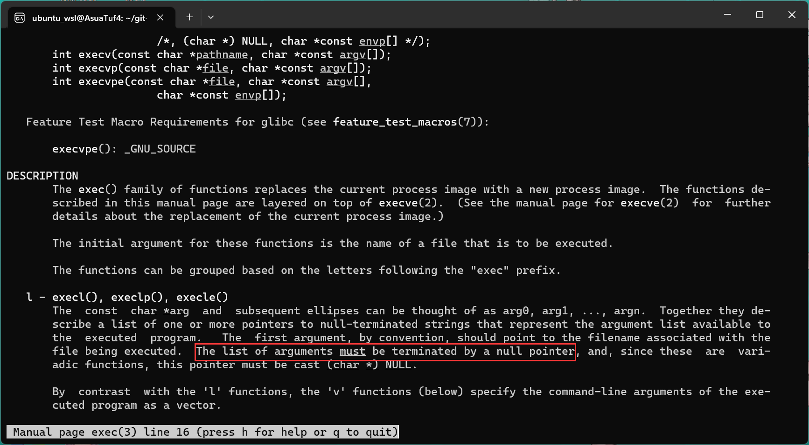

# 记录学习过程的问题和解决过程

## 环境准备

参考[这里](https://zhuanlan.zhihu.com/p/509296983)

riscv64-linux-gnu-gcc版本不要太高(riscv64-linux-gnu-gcc-12会无法编译)

## GDB准备

首先在一个窗口中运行:

```shell
make qemu-gdb
```



然后再另外一个窗口(相同目录下)中运行gdb-multiarch:



在gdb中连接qemu的debug服务器：

```shell
(gdb) remote debugging using localhost:26000
```

使用file命令加载可执行调试符号，以调试ls用户命令为例子（参考这篇[文章](https://zhuanlan.zhihu.com/p/342402097)）:

```shell
(gdb) file user/_ls
(gdb) b main
(gdb) c
```

```shell
# 在xv6的shell中
(xv6) ls
```



## VSCode开发环境

1. 无法找到头文件

    改一下头文件的引用方式，并不会影响编译，例如：#include "kernel/stat.h" 改为 #include "../kernel/stat.h"。

2. 使用gdb-multiarch调试内核

    先安装Native Debug拓展：

    

    以调试ls命令为例，在launch.json中添加以下内容，参考[这里](https://nnfw.readthedocs.io/en/stable/howto/how-to-remote-debugging-with-visual-studio-code.html#:~:text=Install%20gdb-multiarch%20%C2%B6%20Install%20gdb-multiarch%20%24%20sudo%20apt,-%3E%20Add%20configuration%20-%3E%20GDB%3A%20Connect%20to%20gdbserver):

    ```json
    {
    "version": "0.2.0",
    "configurations": [
            {
                "type": "gdb",
                "request": "attach",
                "name": "Attach to gdbserver",
                "gdbpath": "/usr/bin/gdb-multiarch",
                "executable": "./user/_ls",
                "target": "localhost:26000",
                "remote": true,
                "printCalls": true,
                "cwd": "${workspaceRoot}",
                "valuesFormatting": "parseText"
            }
        ]
    }
    ```

    然后在一个终端中启动调试服务器

    ```shell
    make qemu-gdb
    # 在xv6中运行命令
    (xv6) ls
    ```

    设置断点，运行调试：

    

    如果不想每次都手动启动qemu的gdb服务器可以设置tasks.json

    ```json
    {
        "version": "2.0.0",
        "tasks": [
            {
                "label": "preDebug",
                "command": "make qemu-gdb",
                "type": "shell",
                "isBackground": true
            }
        ]
    }
    ```

    然后在"configurations"列表中增加以下内容：

    ```json
    {
        "name": "(gdb) 启动",
        "type": "cppdbg",
        "request": "launch",
        "program": "${workspaceFolder}/user/_ls",
        "args": [],
        "stopAtEntry": false,
        "cwd": "${fileDirname}",
        "environment": [],
        "externalConsole": false,
        "preLaunchTask": "preDebug",
        "MIMode": "gdb",
        "miDebuggerPath": "/usr/bin/gdb-multiarch",
        "miDebuggerServerAddress":"localhost:26000",
        "setupCommands": [
            {
                "description": "为 gdb 启用整齐打印",
                "text": "-enable-pretty-printing",
                "ignoreFailures": true
            },
            {
                "description": "将反汇编风格设置为 Intel",
                "text": "-gdb-set disassembly-flavor intel",
                "ignoreFailures": true
            }
        ]
    }
    ```

## lab1 bugs review

1. Exec系统调用Bug

    argv必须以一个0结尾，否则可能无法正确执行。


